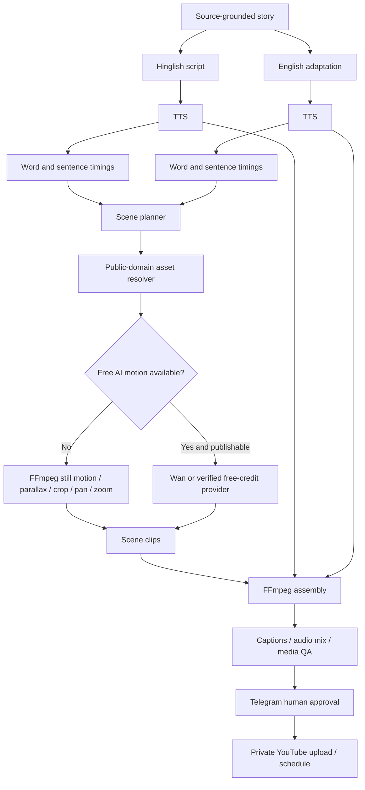
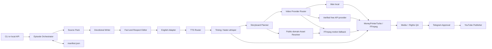

# Devotional Video Engine: $0-First Open-Source Architecture and Codex Implementation Specification

## Executive summary

The recommended implementation is **not a new video generator built from scratch**. It is a thin devotional-content layer on top of a mature open-source video-production foundation.

The architecture should be:

> **MoneyPrinterTurbo fork for media production + a new Devotional Intelligence layer + public-domain asset ingestion + optional Wan 2.2 local AI motion + faster-whisper timing + FFmpeg final assembly + optional Ollama local LLM + Telegram human approval + official YouTube Data API publishing.**

MoneyPrinterTurbo is the clear primary foundation. As of 7 October 2026 it has about **129,000 GitHub stars**, an MIT licence, and active commits on the same day; its current task service already integrates video/material/TTS/subtitle/music providers and supports sources including local media, Pexels, Pixabay, Coverr and several generated-video providers. fileciteturn37file0L2-L2 fileciteturn39file0L2-L2 fileciteturn38file0L2-L2

The important architectural decision is to **reuse MoneyPrinterTurbo's plumbing but replace its generic content intelligence**. The valuable custom code is the part that produces distinctive, grounded, clean, humorous devotional scripts rather than generic AI narration.

The default MVP will take **one devotional story package** and produce:

```text
episode/
├── scripts/
│   ├── hinglish.md
│   └── english.md
├── audio/
│   ├── hinglish.wav
│   └── english.wav
├── timings/
│   ├── hinglish.json
│   └── english.json
├── assets/
├── scenes/
├── captions/
├── manifest.json
└── renders/
    ├── episode_hinglish.mp4
    └── episode_english.mp4
```

The English video is an **adaptation**, not a literal translation. The two versions share research, claims, visual assets and scene concepts, but narration timing is generated separately so each language sounds natural.

The core content rule is:

> **Respect → factual integrity → entertainment → humour.**

Humour may come from the situation, narration timing, relatable observations and modern analogies. It may **not** come from mocking a deity, scripture, ritual, devotee, tradition, caste, sect or community. There should be no vulgarity, sexual humour, double meaning, abusive language, political jokes or invented religious facts.

The system must have a stronger technical guarantee too:

> **A complete publishable MP4 must be producible even when every commercial AI-video provider has zero free credits.**

Therefore cloud AI video is an enhancement, not a dependency. The guaranteed path is:



### Final technology decision

| Capability | Selected implementation |
|---|---|
| Core media engine | **Fork MoneyPrinterTurbo** |
| Custom intelligence | New `app/services/devotional/` package |
| LLM at $0 | **Ollama adapter**, plus OpenAI-compatible optional adapter |
| Script style | Source-grounded humorous Hinglish + separately adapted English |
| Default visuals | **Public-domain/CC0 artwork** |
| Free animation | FFmpeg motion, crop, zoom, parallax-style treatment |
| Local generative video | **Wan 2.2 TI2V-5B**, optional |
| Cloud AI video | Free-credit router; all paid calls disabled by default |
| TTS | **Google Chirp 3 HD first benchmark**, ElevenLabs benchmark, Edge TTS development fallback |
| Timing | Provider marks when available, otherwise **faster-whisper word timestamps** |
| Captions | ASS/SRT generated locally |
| Renderer | MoneyPrinterTurbo + FFmpeg |
| State | `manifest.json`; SQLite only when useful for indexing |
| Approval | Telegram Bot API with local long polling |
| Publishing | Official YouTube Data API |
| Server | None |
| Redis | Not required |
| PostgreSQL | Not required |
| Docker | Optional |
| Kubernetes | No |
| Agent framework | No |
| Mandatory monthly API spend | **$0** |
| Human approval | Mandatory before publishing |

The `$0` figure refers to **direct platform/API expenditure**, not the cost of your existing computer, internet connection, storage or electricity. Google Cloud TTS can also be $0 within its published monthly free-usage allowance, but Google requires billing to be enabled and will charge if the allowance is exceeded, so the application must enforce its own conservative character limit. citeturn13search1

## Open-source repositories to reuse

The repository strategy matters because blindly merging several "AI YouTube automation" projects would produce more maintenance work than writing the missing pieces ourselves.

### Prioritised repository matrix

| Priority | Repository | Licence | Maturity as of 7 Oct 2026 | Role | Reuse decision |
|---|---|---|---|---|---|
| **P0** | [harry0703/MoneyPrinterTurbo](https://github.com/harry0703/MoneyPrinterTurbo) | MIT | ~129,087 stars; latest commit 7 Oct 2026 | Video-production backbone | **Fork** |
| **P0** | [SYSTRAN/faster-whisper](https://github.com/SYSTRAN/faster-whisper) | MIT | ~25,742 stars; latest commit 6 Oct 2026 | Word-level speech timings | **Dependency** |
| **P1** | [Wan-Video/Wan2.2](https://github.com/Wan-Video/Wan2.2) | Apache-2.0 repo | ~17,765 stars; latest commit 21 Sep 2026 | Optional local AI video | **External subprocess/backend** |
| **P1** | [Huanshere/VideoLingo](https://github.com/Huanshere/VideoLingo) | Apache-2.0 | ~18,691 stars; latest commit 30 Sep 2026 | Dubbing/timing/subtitle implementation reference | **Selective reuse** |
| **P1** | [ollama/ollama](https://github.com/ollama/ollama) | MIT | ~182,477 stars; latest commit 7 Oct 2026 | Local `$0` LLM runtime | **External service** |
| **P2** | [rany2/edge-tts](https://github.com/rany2/edge-tts) | LGPLv3 for most code; MIT for SRT composer | ~12,186 stars; latest commit 22 Mar 2026 | Development TTS fallback | **Dependency, not vendored** |
| **P2** | [FujiwaraChoki/MoneyPrinterV2](https://github.com/FujiwaraChoki/MoneyPrinterV2) | AGPL-3.0 | ~32,056 stars; latest commit 15 Sep 2026 | Reference for publishing/scheduling patterns | **Reference only** |
| **Reference** | [youtube/api-samples](https://github.com/youtube/api-samples) | GitHub metadata does not currently identify a licence | ~6,026 stars; repository archived | Historical upload examples | **Do not vendor; use current docs** |

MoneyPrinterTurbo's current activity is particularly strong: its latest default-branch commit observed during this research was committed on 7 October 2026. fileciteturn37file0L2-L2 fileciteturn39file0L2-L2

MoneyPrinterV2 is also actively maintained, but it is AGPL-3.0. Mixing its implementation directly into an MIT-based MoneyPrinterTurbo fork would materially complicate licensing, so the safer engineering decision is to study its workflow rather than copy its code. Its latest observed commit was 15 September 2026. fileciteturn46file0L2-L2 fileciteturn40file0L2-L2

Wan 2.2's repository is Apache-2.0 and its current repository metadata reports about 17.8K stars; the latest observed commit was 21 September 2026. fileciteturn47file0L2-L2 fileciteturn41file0L2-L2

VideoLingo is useful because it already solves several tedious dubbing problems—speech recognition/alignment, subtitle segmentation, translation, TTS, audio merging and dubbing back into video—and exposes a local HTTP API. Its project states Apache-2.0 licensing and supports `uv run start.py` as its source installation/run path. fileciteturn36file0L2-L2 Its latest observed commit was 30 September 2026. fileciteturn42file0L2-L2

Faster-whisper is especially valuable because it supports word-level timestamps and CPU INT8 execution, so narration timing does not have to depend on a paid speech API. Its README states Python 3.9+, direct `pip install faster-whisper`, CPU execution and `word_timestamps=True`; its latest observed commit was 6 October 2026. fileciteturn35file0L2-L2 fileciteturn43file0L2-L2

Ollama provides the optional fully local LLM path. Its latest observed commit was on 7 October 2026. fileciteturn44file0L2-L2

Edge-TTS can call Microsoft's Edge speech service without an API key, but its code licence and the legal right to commercially publish output from the underlying online service are separate questions. The repository itself explicitly licences most files under LGPLv3, with only its SRT composer under MIT. fileciteturn33file0L2-L2 fileciteturn34file0L2-L2 It is therefore suitable for local previews, but the production gate should default `edge_tts.publishable = false` unless the applicable service terms have separately been verified.

### MoneyPrinterTurbo: primary codebase

**Repository:** `https://github.com/harry0703/MoneyPrinterTurbo`

**Keep upstream almost intact.** MoneyPrinterTurbo already has the orchestration structures we would otherwise have to develop: media retrieval/provider routing, TTS, subtitles, music, video assembly, APIs and task state. Its current `app/services/task.py` imports the video, material, voice, subtitle and generated-media services and has explicit supported-video-source routing. fileciteturn38file0L2-L2

The important existing paths to retain are:

```text
app/services/task.py
app/services/video.py
app/services/material.py
app/services/voice.py
app/services/subtitle.py
app/services/task_artifacts.py

app/services/volcengine_seedance.py
app/services/metaso_minimax.py
app/services/muapi.py
app/services/ofox.py

app/controllers/v1/llm.py
app/controllers/v1/video.py

app/models/schema.py
app/models/llm_provider.py

app/config/
config.example.toml
cli.py

test/services/test_video.py
test/services/test_voice.py
```

**Do not rewrite** `app/services/video.py` unless an incompatibility forces us to. Add our layer around its existing rendering functions.

Create:

```text
app/services/devotional/
├── __init__.py
├── cli.py
├── orchestrator.py
├── manifest.py
├── state.py
├── contracts.py
├── policy.py
├── budget.py
├── provenance.py
│
├── script/
│   ├── source_pack.py
│   ├── writer.py
│   ├── adapter.py
│   ├── safety.py
│   └── schemas.py
│
├── timing/
│   ├── align.py
│   └── captions.py
│
├── assets/
│   ├── resolver.py
│   ├── rights.py
│   ├── met.py
│   ├── smithsonian.py
│   ├── cleveland.py
│   ├── artic.py
│   └── wikimedia.py
│
├── providers/
│   ├── registry.py
│   ├── llm/
│   │   ├── ollama.py
│   │   └── openai_compatible.py
│   ├── tts/
│   │   ├── google_chirp.py
│   │   ├── elevenlabs.py
│   │   └── edge_preview.py
│   └── video/
│       ├── ffmpeg_motion.py
│       ├── wan22.py
│       ├── cloud_base.py
│       └── router.py
│
├── render/
│   ├── scene_renderer.py
│   ├── ffmpeg.py
│   └── validator.py
│
├── approval/
│   └── telegram.py
│
└── publish/
    └── youtube.py
```

Only four existing MPT areas should need narrow integration changes:

```text
app/models/schema.py
    add devotional mode / episode fields

app/services/task.py
    dispatch devotional tasks into devotional.orchestrator

app/services/material.py
    accept manifest-resolved local/licensed assets

app/services/voice.py
    optionally delegate devotional narration to TTSRouter
```

Then add one CLI/API hook rather than changing multiple controllers:

```text
cli.py
app/controllers/v1/video.py
```

The upstream repository should remain easy to merge.

**Bootstrap target:**

```bash
git clone https://github.com/harry0703/MoneyPrinterTurbo.git devotional-video-engine
cd devotional-video-engine

uv python install 3.11
uv sync --frozen

cp config.example.toml config.toml
```

The devotional code should be runnable independently of the Web UI:

```bash
uv run python -m app.services.devotional.cli create \
  --topic "Krishna and Sudama" \
  --languages hinglish,en \
  --duration 120
```

### MoneyPrinterV2: reference, not foundation

**Repository:** `https://github.com/FujiwaraChoki/MoneyPrinterV2`

The relevant areas are:

```text
src/classes/YouTube.py
src/classes/Tts.py
src/cache.py
src/config.py
src/constants.py

docs/YouTube.md
docs/Configuration.md

scripts/upload_video.sh
scripts/setup_local.sh
scripts/preflight_local.py
```

Its current repository is AGPL-3.0. fileciteturn46file0L2-L2

Therefore:

```text
DO:
study upload flow
study caching patterns
study scheduling / CLI patterns

DO NOT:
copy its YouTube.py into the MIT fork
copy its TTS implementation
make it an imported Python dependency
```

If somebody later decides to run MoneyPrinterV2 itself, its documented pattern is a Python 3.12 virtual environment, installation from `requirements.txt`, and execution via `src/main.py`. For our system, however, its code paths should **not be patched at all**; its architectural ideas should be independently reimplemented.

### Wan 2.2: optional local generative-video backend

**Repository:** `https://github.com/Wan-Video/Wan2.2`

Relevant upstream paths:

```text
generate.py

wan/
├── __init__.py
├── animate.py
├── configs/
└── ...

requirements.txt
requirements_s2v.txt
requirements_animate.txt
pyproject.toml
tests/test.sh
```

Do **not** fork and modify the Wan model implementation.

Our only integration should be:

```text
app/services/devotional/providers/video/wan22.py
```

which invokes `generate.py` as a controlled subprocess.

Wan 2.2's official project includes T2V, I2V/TI2V and other video-generation variants; the TI2V-5B model is the practical candidate for this project because the project documents 720p/24fps operation and says the single-GPU TI2V-5B configuration can run with at least **24 GB of VRAM**, whereas the larger A14B configurations demand substantially more memory. fileciteturn47file0L2-L2

This makes Wan **optional**, not an MVP requirement.

### VideoLingo: copy concepts and small Apache-licensed components

**Repository:** `https://github.com/Huanshere/VideoLingo`

The paths worth examining are:

```text
core/_2_asr.py
core/_4_2_translate.py
core/_5_split_sub.py
core/_6_gen_sub.py
core/_7_sub_into_vid.py

core/_8_1_audio_task.py
core/_8_2_dub_chunks.py
core/_10_gen_audio.py
core/_11_merge_audio.py
core/_12_dub_to_vid.py

core/asr_backend/
core/tts_backend/custom_tts.py

core/pipeline.py
core/prompts.py

api.py
config.yaml
```

VideoLingo's existing workflow includes recognition/alignment, translation, subtitle segmentation, dubbing and audio/video merging, and its README documents both a Streamlit application and a local HTTP API. fileciteturn36file0L2-L2

Build/run:

```bash
git clone https://github.com/Huanshere/VideoLingo.git
cd VideoLingo
uv run start.py
```

or:

```bash
uv run start.py --api
```

We **should not run VideoLingo as a required second application**. Port or adapt only algorithms that materially improve sentence segmentation, subtitle fitting or language adaptation.

### Faster-whisper: timing dependency

**Repository:** `https://github.com/SYSTRAN/faster-whisper`

No upstream modifications.

Install:

```bash
uv add faster-whisper
```

or:

```bash
pip install faster-whisper
```

Adapter:

```text
app/services/devotional/timing/align.py
```

Minimal implementation:

```python
from faster_whisper import WhisperModel

model = WhisperModel(
    "small",
    device="cpu",
    compute_type="int8",
)

segments, info = model.transcribe(
    "narration.wav",
    word_timestamps=True,
    vad_filter=True,
)

words = [
    {
        "text": word.word,
        "start_ms": int(word.start * 1000),
        "end_ms": int(word.end * 1000),
    }
    for segment in segments
    for word in (segment.words or [])
]
```

Faster-whisper explicitly supports word timestamps and CPU INT8 operation. fileciteturn35file0L2-L2

### Ollama: optional fully-local script provider

**Repository:** `https://github.com/ollama/ollama`

Do not modify Ollama.

Our code:

```text
app/services/devotional/providers/llm/ollama.py
```

should talk to its local API.

Architecture:

```text
Devotional engine
      │
      │ JSON request
      ▼
http://127.0.0.1:11434
      │
      ▼
Ollama
      │
      ▼
local multilingual LLM
```

The exact model should remain configuration, because model quality and local hardware are separate decisions.

Required configuration:

```toml
[devotional.llm]
provider = "ollama"
base_url = "http://127.0.0.1:11434"
model = "USER_SELECTED_MODEL"
timeout_seconds = 180
```

### Edge-TTS: preview fallback

**Repository:** `https://github.com/rany2/edge-tts`

Install it as a package rather than copying it:

```bash
uv add edge-tts
```

The repository says it can access Edge's online TTS without Windows, Microsoft Edge or a separate API key. fileciteturn33file0L2-L2

However:

```yaml
provider: edge_tts
cost_class: free
publishable: false
purpose:
  - development
  - preview
  - voice_comparison
```

until output/commercial-use rights have been separately confirmed.

This also keeps its LGPL implementation isolated as a dependency instead of mixing its source with our MIT code. fileciteturn34file0L2-L2

## Target architecture, contracts and data model

The engine should remain a **local Python monolith**, not a distributed architecture.



### Content-generation contract

The script generator must not be given the vague prompt "write a Hindu mythology video."

It receives a structured source pack:

```json
{
  "topic": "Krishna and Sudama",
  "target_duration_seconds": 120,
  "sources": [
    {
      "source_id": "src_001",
      "title": "source title",
      "tradition": "identified tradition or text",
      "passages": [
        {
          "passage_id": "p001",
          "text": "retrieved source passage"
        }
      ]
    }
  ]
}
```

Its Hinglish output must contain structured claims:

```json
{
  "title": "Why Krishna Ran to Meet Sudama",
  "hook": "Dwarka mein ek visitor aaya...",
  "segments": [
    {
      "id": "seg_001",
      "narration": "Sudama ji Dwarka पहुंचे...",
      "claim_ids": ["claim_001"],
      "humour_type": "situational",
      "visual_intent": "Sudama approaching Dwarka"
    }
  ],
  "claims": [
    {
      "id": "claim_001",
      "statement": "Sudama arrived to meet Krishna",
      "source_passage_ids": ["p001"]
    }
  ]
}
```

Then the English adaptation uses the **same claim set** but rewrites idiom, pacing and jokes naturally for an Indian-English/global-English listener. It may not introduce a new factual claim unless that claim goes through the grounding stage.

The non-negotiable policy prompt should effectively contain:

```text
VOICE
Natural, conversational Hinglish.
Intelligent storyteller speaking to a friend.
Not a sermon, textbook, Wikipedia article or generic mythology narrator.

HUMOUR ALLOWED
Situational humour
Observational humour
Relatable everyday analogies
Comic timing
Narrator reactions
Gentle modern comparisons

HUMOUR FORBIDDEN
Mocking a deity
Mocking scripture
Mocking religious practice
Mocking devotees
Mocking a caste, sect, community or tradition
Sexual jokes
Vulgarity
Double meanings
Abusive language
Political jokes
Insulting nicknames for revered figures

FACTUAL RULE
Never invent a religious fact to improve a joke.
If traditions differ, state that versions/traditions differ.
If a joke changes the meaning of the source, delete the joke.

VISUAL RULE
Revered figures remain dignified.
Do not visually caricature or grotesquely deform sacred figures for comedy.
Humour should normally come from narration/editing rather than deity depiction.

ORDER OF PRIORITIES
1. Respect
2. Factual integrity
3. Entertainment
4. Humour
```

### Episode state machine

```text
CREATED
   ↓
SOURCED
   ↓
SCRIPTED
   ↓
SAFETY_PASSED
   ↓
VOICED
   ↓
TIMED
   ↓
STORYBOARDED
   ↓
ASSETS_READY
   ↓
RENDERED
   ↓
MEDIA_QA
   ↓
AWAITING_APPROVAL
   ↓
APPROVED
   ↓
SCHEDULED
   ↓
PUBLISHED
```

A failure never deletes preceding completed work.

For example:

```text
scene 7 AI generation fails
       ↓
manifest scene 7 = failed
       ↓
router chooses FFmpeg fallback
       ↓
scenes 1–6 and 8–20 untouched
       ↓
render resumes
```

### `manifest.json` contract

`manifest.json` is the canonical episode state. SQLite may later index manifests, but SQLite should **not** become required to reconstruct an episode.

Codex should implement `app/services/devotional/manifest.schema.json` approximately as follows:

```json
{
  "$schema": "https://json-schema.org/draft/2020-12/schema",
  "$id": "devotional-episode-manifest-1.0",
  "type": "object",
  "required": [
    "schema_version",
    "episode",
    "sources",
    "scripts",
    "claims",
    "voices",
    "scenes",
    "assets",
    "renders",
    "budget",
    "approvals"
  ],
  "properties": {
    "schema_version": {
      "const": "1.0"
    },
    "episode": {
      "type": "object",
      "required": ["id", "topic", "state", "created_at"],
      "properties": {
        "id": {"type": "string"},
        "topic": {"type": "string"},
        "state": {
          "enum": [
            "CREATED",
            "SOURCED",
            "SCRIPTED",
            "SAFETY_PASSED",
            "VOICED",
            "TIMED",
            "STORYBOARDED",
            "ASSETS_READY",
            "RENDERED",
            "MEDIA_QA",
            "AWAITING_APPROVAL",
            "APPROVED",
            "SCHEDULED",
            "PUBLISHED",
            "FAILED"
          ]
        },
        "created_at": {"type": "string", "format": "date-time"},
        "content_policy_version": {"type": "string"}
      }
    },
    "sources": {
      "type": "array",
      "items": {
        "type": "object",
        "required": ["source_id", "title"],
        "properties": {
          "source_id": {"type": "string"},
          "title": {"type": "string"},
          "url": {"type": ["string", "null"]},
          "tradition": {"type": ["string", "null"]},
          "content_hash": {"type": "string"}
        }
      }
    },
    "claims": {
      "type": "array",
      "items": {
        "type": "object",
        "required": ["claim_id", "statement", "source_ids", "status"],
        "properties": {
          "claim_id": {"type": "string"},
          "statement": {"type": "string"},
          "source_ids": {
            "type": "array",
            "items": {"type": "string"}
          },
          "status": {
            "enum": ["verified", "qualified", "rejected"]
          }
        }
      }
    },
    "scripts": {
      "type": "object",
      "required": ["hinglish", "english"],
      "properties": {
        "hinglish": {"$ref": "#/$defs/script"},
        "english": {"$ref": "#/$defs/script"}
      }
    },
    "voices": {
      "type": "object",
      "properties": {
        "hinglish": {"$ref": "#/$defs/voice"},
        "english": {"$ref": "#/$defs/voice"}
      }
    },
    "scenes": {
      "type": "array",
      "items": {
        "type": "object",
        "required": [
          "scene_id",
          "start_ms",
          "end_ms",
          "visual_type"
        ],
        "properties": {
          "scene_id": {"type": "string"},
          "start_ms": {"type": "integer"},
          "end_ms": {"type": "integer"},
          "visual_type": {
            "enum": [
              "public_domain_still",
              "public_domain_video",
              "local_motion",
              "wan_video",
              "cloud_video",
              "title_card",
              "map",
              "text"
            ]
          },
          "asset_ids": {
            "type": "array",
            "items": {"type": "string"}
          },
          "prompt": {"type": ["string", "null"]},
          "provider": {"type": ["string", "null"]},
          "input_hash": {"type": "string"},
          "output_path": {"type": ["string", "null"]}
        }
      }
    },
    "assets": {
      "type": "array",
      "items": {"$ref": "#/$defs/asset"}
    },
    "renders": {
      "type": "object",
      "properties": {
        "hinglish_mp4": {"type": ["string", "null"]},
        "english_mp4": {"type": ["string", "null"]},
        "thumbnail": {"type": ["string", "null"]}
      }
    },
    "budget": {
      "type": "object",
      "required": ["hard_cap_usd", "spent_usd"],
      "properties": {
        "hard_cap_usd": {"type": "number", "minimum": 0},
        "spent_usd": {"type": "number", "minimum": 0},
        "reserved_usd": {"type": "number", "minimum": 0}
      }
    },
    "approvals": {
      "type": "array",
      "items": {
        "type": "object",
        "properties": {
          "manifest_hash": {"type": "string"},
          "approved_by": {"type": "string"},
          "approved_at": {
            "type": "string",
            "format": "date-time"
          },
          "scope": {
            "enum": ["hinglish", "english", "both"]
          }
        }
      }
    }
  },
  "$defs": {
    "script": {
      "type": "object",
      "required": ["path", "segments"],
      "properties": {
        "path": {"type": "string"},
        "segments": {"type": "array"}
      }
    },
    "voice": {
      "type": "object",
      "required": [
        "provider",
        "audio_path",
        "rights_status"
      ],
      "properties": {
        "provider": {"type": "string"},
        "voice_id": {"type": "string"},
        "audio_path": {"type": "string"},
        "timings_path": {"type": ["string", "null"]},
        "characters": {"type": "integer"},
        "cost_usd": {"type": "number"},
        "rights_status": {
          "enum": ["allowed", "forbidden", "verify"]
        }
      }
    },
    "asset": {
      "type": "object",
      "required": [
        "asset_id",
        "source",
        "source_url",
        "license",
        "commercial_ok",
        "sha256"
      ],
      "properties": {
        "asset_id": {"type": "string"},
        "source": {"type": "string"},
        "source_url": {"type": "string"},
        "download_url": {"type": ["string", "null"]},
        "title": {"type": ["string", "null"]},
        "creator": {"type": ["string", "null"]},
        "license": {"type": "string"},
        "license_url": {"type": ["string", "null"]},
        "commercial_ok": {"type": "boolean"},
        "attribution_required": {"type": "boolean"},
        "attribution_text": {"type": ["string", "null"]},
        "rights_snapshot_path": {"type": "string"},
        "sacred_visual_review": {
          "enum": ["approved", "rejected", "not_required", "pending"]
        },
        "sha256": {"type": "string"},
        "local_path": {"type": "string"}
      }
    }
  }
}
```

Every expensive or externally generated artifact gets an input hash. If:

```text
provider + model + prompt + reference-image hash + settings
```

has not changed, regeneration must reuse the cached artifact.

### Provider abstraction

Do **not** let application code import Kling, Wan, Google or ElevenLabs-specific logic.

Use interfaces.

```python
from dataclasses import dataclass
from typing import Literal, Protocol

RightsStatus = Literal["allowed", "forbidden", "verify"]


@dataclass(frozen=True)
class CostEstimate:
    usd: float
    free_allowance_expected: bool
    confidence: Literal["exact", "estimated", "unknown"]


@dataclass(frozen=True)
class ProviderCapabilities:
    local: bool
    api_automatable: bool
    modes: frozenset[str]
    max_duration_seconds: float | None
    watermark: bool | None
    commercial_use: RightsStatus
    free_quota_description: str | None


@dataclass(frozen=True)
class VideoRequest:
    scene_id: str
    prompt: str
    duration_seconds: float
    width: int
    height: int
    reference_image: str | None = None


@dataclass(frozen=True)
class VideoArtifact:
    path: str
    provider: str
    model: str
    actual_cost_usd: float
    rights_status: RightsStatus
    watermark: bool | None
    sha256: str


class VideoProvider(Protocol):
    name: str

    def capabilities(self) -> ProviderCapabilities: ...
    def available(self) -> bool: ...
    def estimate(self, request: VideoRequest) -> CostEstimate: ...
    def generate(self, request: VideoRequest) -> VideoArtifact: ...
```

TTS has the same pattern:

```python
@dataclass(frozen=True)
class SpeechRequest:
    text: str
    locale: str
    voice_id: str
    output_format: Literal["wav", "mp3"] = "wav"


@dataclass(frozen=True)
class SpeechArtifact:
    audio_path: str
    duration_ms: int
    marks_path: str | None
    characters: int
    cost_usd: float
    rights_status: RightsStatus


class TTSProvider(Protocol):
    name: str

    def available(self) -> bool: ...
    def estimate(self, request: SpeechRequest) -> CostEstimate: ...
    def synthesize(self, request: SpeechRequest) -> SpeechArtifact: ...
```

LLMs are equally generic:

```python
class LLMProvider(Protocol):
    name: str

    def available(self) -> bool: ...

    def generate_json(
        self,
        *,
        system_prompt: str,
        user_prompt: str,
        schema: dict,
        temperature: float,
    ) -> dict:
        ...
```

The orchestrator therefore only knows:

```python
llm.generate_json(...)
tts.synthesize(...)
video.generate(...)
```

not vendor names.

## Video, voice, assets and final rendering

### Free-credit video router

The free-credit system should never assume that "free on a website" means "free through an API."

That distinction is crucial.

| Provider | Automation mode | Current free opportunity | Watermark | Commercial status | Production default |
|---|---|---|---|---|---|
| **FFmpeg local motion** | Local | Unlimited software usage | No | Determined by input asset | **ON** |
| **Wan 2.2 local** | Local | No API fee; own compute | No platform watermark requirement known | Verify checkpoint/model terms in manifest | **ON when compatible hardware exists** |
| Google Veo / Vertex | API | General Google Cloud new-customer credits may be available; recurring Veo free quota **unspecified** | Verify | Verify current service terms | OFF |
| Runway Dev | API | Free API video quota **unspecified** | Verify | Verify current API terms | OFF |
| Luma API | API | Free API quota **unspecified** | API outputs documented as watermark-free | API commercial use documented as allowed | OFF until funded |
| MiniMax/Hailuo API | API | Free video API quota **unspecified** | Verify | Verify | OFF |
| PixVerse Basic | Consumer web | 60 initial + 30 daily credits currently advertised | Basic is not advertised as watermark-free | Commercial rights **unspecified** | Manual testing only |
| Kling | API/web | **Unspecified** from a primary source in this research | Unspecified | Unspecified | Disabled until verified |

Google currently advertises a **$300 welcome credit for eligible new Cloud customers**, but that is a general Cloud trial, not a stable recurring Veo allowance and should never be hard-coded as a guaranteed video quota. citeturn14search4turn14search8

Runway's developer API is explicitly credit-priced, currently at $0.01 per credit, with video models billed by generated second/model/resolution. Its official pricing page does not establish a recurring general-purpose free video-generation API quota that this architecture should depend upon. citeturn14search0

Luma states that images and videos generated through its API have no watermark and that API-generated images/videos may be commercially used; an ongoing free API quota was not established in the official material found during this research. citeturn19search1

MiniMax has hosted video generation and an API, but its current subscription material associates included Hailuo video generations with paid tiers; therefore the architecture should treat any promotional/free hosted API allowance as **unspecified until verified at runtime**. citeturn19search0turn19search12

PixVerse's current consumer Basic plan advertises **60 initial credits and 30 daily credits**, up to 540p, while its pricing page associates API access with the Enterprise offering. Therefore those Basic credits are useful for manual experiments but should not be treated as an automatable API resource. citeturn19search2

The router should implement:

```python
def choose_video_provider(scene, registry, budget):
    # Guaranteed zero-cost path.
    if scene.can_use_existing_asset:
        return registry["ffmpeg_motion"]

    # Local generative motion if hardware is sufficient.
    wan = registry.get("wan22")
    if (
        wan
        and wan.available()
        and wan.capabilities().commercial_use != "forbidden"
    ):
        return wan

    # Optional verified free API allowances.
    for provider in registry.free_api_providers():
        caps = provider.capabilities()

        if caps.commercial_use != "allowed":
            continue

        if caps.watermark is True:
            continue

        estimate = provider.estimate(scene.video_request)

        if estimate.confidence == "unknown":
            continue

        if budget.can_reserve(estimate.usd):
            return provider

    # Never fail merely because free AI-video credits disappeared.
    return registry["ffmpeg_motion"]
```

The global defaults are:

```toml
[devotional.budget]
hard_cap_usd = 0.00
allow_paid_providers = false
allow_unknown_cost = false
allow_unknown_commercial_rights = false
```

Free-provider metadata must not be buried in code:

```yaml
providers:
  pixverse_web:
    mode: manual_web
    free_quota:
      description: "60 initial + 30 daily"
      verified_at: "2026-10-07"
    commercial_use: verify
    api_automatable: false

  kling:
    mode: disabled
    free_quota:
      description: unspecified
      verified_at: null
    commercial_use: verify
    api_automatable: null
```

No automation should create multiple accounts, evade quotas, bypass CAPTCHA or otherwise circumvent provider restrictions.

### TTS recommendation

TTS is the one area where a tiny future spend is more defensible because the channel's personality depends heavily on narration.

For the initial benchmark:

| TTS | Hindi | Indian English | Initial cost position | Publishing recommendation |
|---|---|---|---|---|
| **Google Chirp 3 HD** | `hi-IN` | `en-IN` | 0–1M characters/month currently free; billing required | **First candidate** |
| ElevenLabs | Multilingual | Multilingual | Free allocation exists, but free output lacks commercial licence | Benchmark only on free tier |
| Edge-TTS | Yes, voice-dependent | Yes | No API key | Preview/dev only |
| Future local TTS | Model-dependent | Model-dependent | Local compute | Add only after quality benchmark |

Google currently lists both Hindi India (`hi-IN`) and English India (`en-IN`) for Chirp 3 HD, along with multiple voices. citeturn13search0turn13search4 It also supports pause/pace controls across locales, with custom pronunciation supported across most locales, which is particularly useful for words such as *Dwarka*, *Sudama*, *Hanuman*, *Mahabharata* and Sanskrit-derived names. citeturn13search2

Google's current published price is **free for the first one million Chirp 3 HD characters per month, then $30 per million**, but billing must be enabled and Google warns that over-limit usage is automatically charged. citeturn13search1

Therefore configure:

```toml
[devotional.tts.google_chirp]
enabled = true

# Deliberately below Google's published 1M allowance.
internal_monthly_character_cap = 900000

allow_overage = false
```

The application itself must reserve characters **before** synthesis:

```python
if monthly_used + requested_chars > internal_monthly_character_cap:
    raise BudgetLimitExceeded("TTS monthly safety allowance reached")
```

ElevenLabs' current API pricing lists approximately $0.10 per 1,000 characters for v2/v3 and $0.05 per 1,000 for Flash/Turbo-class TTS. citeturn14search2turn14search6 More importantly for the `$0-first` design, ElevenLabs explicitly says **its free plan does not include a commercial licence**; content created under a paid subscription has commercial rights subject to its terms. citeturn15search0turn15search3

So:

```yaml
elevenlabs_free:
  use_for_benchmark: true
  publishable: false

elevenlabs_paid:
  use_for_benchmark: true
  publishable: true
  enabled_by_default: false
```

**Standard voice benchmark script — Hinglish:**

> Sudama ji Dwarka पहुँचे तो situation थोड़ी awkward थी. सामने Krishna — राजा भी, मित्र भी, और वही पुराने गुरुकुल वाले दोस्त. Sudama ने शायद सोचा होगा, “बस मिल लेते हैं… gift वाली बात रहने देते हैं.” लेकिन Krishna ने उन्हें देखते ही palace protocol भूलकर दौड़ लगा दी. और यहीं इस story की खूबसूरती है: status बदल चुका था, friendship नहीं. Humour Sudama की familiar hesitation में है; Krishna की dignity में नहीं.

**English adaptation:**

> When Sudama reached Dwarka, the situation must have felt slightly awkward. Krishna was now a king — but also the same friend he had known at the gurukul. Sudama had brought a very modest gift and was hardly eager to show it. Krishna, however, saw his friend and protocol suddenly became the least important thing in the room. That is what makes the moment so warm: status had changed; the friendship had not.

Each candidate voice receives the exact same text.

Score blindly:

| Criterion | Weight |
|---|---:|
| Hindi pronunciation | 20% |
| Krishna/Sudama/Dwarka/Sanskrit-name pronunciation | 15% |
| Hindi-English code switching | 15% |
| Natural conversational delivery | 15% |
| Comic pause/timing | 15% |
| Warmth and devotional dignity | 10% |
| Stability across multiple generations | 5% |
| Cost/rights/API practicality | 5% |

A provider should replace Google only if its improvement is **audible enough to justify its cost or licensing complexity**.

### Narration-first synchronisation

Do not generate clips and then force narration to fit them.

The sequence is:

```text
final script
   ↓
TTS
   ↓
final narration WAV
   ↓
word timestamps
   ↓
sentence/segment timestamps
   ↓
scene durations
   ↓
visual generation
```

When TTS does not return suitable timing markers, faster-whisper creates word-level timestamps locally. fileciteturn35file0L2-L2

The aligner normalises the script and recogniser output, performs fuzzy token alignment, then derives:

```json
{
  "segments": [
    {
      "segment_id": "seg_001",
      "start_ms": 0,
      "end_ms": 6120,
      "words": [
        {
          "text": "Sudama",
          "start_ms": 180,
          "end_ms": 610
        }
      ]
    }
  ]
}
```

The visual is then made **6.12 seconds long**.

Never speed up or slow down narration merely to satisfy generated footage. Instead:

```text
visual too long  -> trim visual
visual too short -> loop, extend still, cross-fade, or choose another asset
voice            -> unchanged
```

Since the English adaptation will have different timing, it gets a separate timeline while reusing the same asset pool:

```text
scene concept        shared
asset                shared
narration            separate
scene duration       separate
caption timings      separate
final MP4            separate
```

### Wan local-run specification

Wan is not required for MVP.

When a suitable NVIDIA GPU exists:

```bash
git clone https://github.com/Wan-Video/Wan2.2.git
cd Wan2.2

python -m venv .venv
source .venv/bin/activate
# Windows:
# .venv\Scripts\activate

pip install -r requirements.txt
```

The official project requires a contemporary PyTorch environment; its TI2V-5B documentation identifies **24 GB VRAM** as the practical single-GPU floor for that configuration. fileciteturn47file0L2-L2

Download the current TI2V-5B checkpoint following the official README/model instructions, then use the current CLI. A representative form is:

```bash
python generate.py \
  --task ti2v-5B \
  --size 1280*704 \
  --ckpt_dir ./Wan2.2-TI2V-5B \
  --offload_model True \
  --convert_model_dtype \
  --t5_cpu \
  --prompt "A respectful traditional Indian illustrated scene ..."
```

For image-conditioned generation, the adapter should first run:

```bash
python generate.py --help
```

and construct the invocation from the CLI shipped with the pinned Wan commit rather than depending on a hand-coded argument list forever.

Pin the tested commit in our configuration:

```yaml
wan:
  repository: "https://github.com/Wan-Video/Wan2.2"
  git_commit: "PIN_AFTER_LOCAL_TEST"
  model: "Wan2.2-TI2V-5B"
  timeout_seconds: 1800
```

Our adapter:

```python
subprocess.run(
    args,
    cwd=wan_repo,
    shell=False,
    check=True,
    timeout=config.timeout_seconds,
)
```

must never execute an LLM-generated shell string.

If:

```text
VRAM < supported minimum
CUDA unavailable
model missing
generation times out
```

then:

```python
WanVideoProvider.available() == False
```

and the router falls back without failing the episode.

### Public-domain visual source manifest

The safest initial hierarchy is:

| Source | Usage model | API? | Engine policy |
|---|---|---:|---|
| **The Met Open Access** | CC0 public-domain artwork images | Yes | Preferred |
| **Smithsonian Open Access** | Assets explicitly marked CC0 | Yes | Preferred |
| **Cleveland Museum of Art Open Access** | CC0 open-access images/data | Yes, no key for OA collection | Preferred |
| **Art Institute of Chicago** | Filter `is_public_domain=true`; IIIF images | Yes | Preferred |
| Wikimedia Commons | PD / varied free licences | Yes | Secondary; per-file verification mandatory |

The Met says its Open Access programme makes public-domain artwork images and collection data available for unrestricted reuse under CC0, and exposes corresponding high-resolution images through its REST API. citeturn16search6

Smithsonian explicitly permits commercial reuse without fees or required attribution for assets designated **CC0**, while warning that third-party rights such as trademark, privacy or publicity may still exist. citeturn16search0

The Cleveland Museum of Art exposes Open Access data and images under CC0, with an API that does not require a token for its open collection. citeturn16search1turn16search2

The Art Institute of Chicago provides IIIF images and explicitly recommends filtering API results with `is_public_domain=true`; it also warns that its image infrastructure can contain non-public-domain images, so public-domain status must be checked on each item. citeturn17search0

Wikimedia Commons requires more care. Individual files can be public domain or have licences such as CC BY or CC BY-SA, with attribution and sometimes share-alike requirements; Wikimedia itself recommends verifying each file's copyright/licensing information before reuse. citeturn17search1turn17search4

Every downloaded asset therefore gets a sidecar:

```json
{
  "asset_id": "met_123456",
  "source": "met",
  "source_item_url": "SOURCE_ITEM_URL",
  "download_url": "SOURCE_IMAGE_URL",
  "title": "Artwork title",
  "creator": "Creator name",
  "work_date": "date if known",
  "license": "CC0",
  "license_url": "LICENSE_URL",
  "work_public_domain": true,
  "digital_asset_commercial_ok": true,
  "attribution_required": false,
  "attribution_text": null,
  "rights_checked_at": "2026-10-07T00:00:00Z",
  "rights_snapshot_path": "rights/met_123456.json",
  "sacred_visual_review": "approved",
  "sha256": "..."
}
```

The renderer must reject:

```text
commercial_ok != true
rights status missing
license unknown
sacred_visual_review == rejected
```

For Wikimedia:

```json
{
  "license": "CC BY-SA 4.0",
  "attribution_required": true,
  "attribution_text": "Creator — title — CC BY-SA 4.0 — source URL"
}
```

The production preference should be **CC0 first** because it dramatically simplifies automated compliance.

### FFmpeg scene rendering

FFmpeg is the guaranteed zero-cost visual renderer.

For a 7.2-second still-image scene:

```bash
DURATION=7.2
FRAMES=216

ffmpeg -y \
  -loop 1 \
  -i assets/scene001.jpg \
  -t "$DURATION" \
  -vf "scale=2200:-2,\
zoompan=z='min(zoom+0.0005,1.08)':\
x='iw/2-(iw/zoom/2)':\
y='ih/2-(ih/zoom/2)':\
d=${FRAMES}:s=1920x1080:fps=30,\
format=yuv420p" \
  -an \
  -c:v libx264 \
  -preset medium \
  -crf 18 \
  scenes/scene001.mp4
```

For a generated clip that is shorter than its narration window:

```bash
ffmpeg -y \
  -stream_loop -1 \
  -i generated_scene.mp4 \
  -t 6.72 \
  -vf "scale=1920:1080:force_original_aspect_ratio=increase,\
crop=1920:1080,\
fps=30,\
setpts=PTS-STARTPTS,\
format=yuv420p" \
  -an \
  -c:v libx264 \
  -preset medium \
  -crf 18 \
  scenes/scene007.mp4
```

Every scene is normalised to:

```text
1920x1080
30 fps
H.264
yuv420p
no scene-level audio
```

That makes concatenation reliable.

Create:

```text
ffconcat version 1.0
file 'scene001.mp4'
file 'scene002.mp4'
file 'scene003.mp4'
```

then:

```bash
ffmpeg -y \
  -f concat \
  -safe 0 \
  -i scenes.ffconcat \
  -c copy \
  visuals.mp4
```

FFmpeg's concat demuxer requires matching streams/codecs/time bases and adjusts timestamps so each input starts after the preceding input; the documentation also permits explicit duration directives where needed. citeturn17search3

For narration plus quiet BGM:

```bash
ffmpeg -y \
  -i visuals.mp4 \
  -i narration.wav \
  -stream_loop -1 \
  -i bgm.mp3 \
  -filter_complex "\
[1:a]aresample=48000[voice];\
[2:a]aresample=48000,volume=0.08[bg];\
[voice][bg]amix=inputs=2:duration=first:normalize=0,\
loudnorm=I=-16:TP=-1.5:LRA=11[a]" \
  -map 0:v:0 \
  -map "[a]" \
  -c:v copy \
  -c:a aac \
  -b:a 192k \
  -shortest \
  pre_caption.mp4
```

BGM remains optional in the MVP. A track can only enter production if it has the same rights-manifest treatment as images.

For captions:

```bash
ffmpeg -y \
  -i pre_caption.mp4 \
  -vf "ass=captions.ass:shaping=complex" \
  -c:v libx264 \
  -crf 18 \
  -preset medium \
  -c:a copy \
  final.mp4
```

Complex shaping matters for Devanagari; FFmpeg's ASS documentation identifies complex shaping as necessary for scripts including Devanagari. FFmpeg also provides `loudnorm` for EBU R128-based loudness normalisation. citeturn18search0

The renderer should generate an ASS file rather than burning plain text ad hoc:

```text
Dialogue: 0,0:00:00.18,0:00:02.90,Default,,0,0,0,,Sudama ji Dwarka पहुँचे तो...
Dialogue: 0,0:00:02.90,0:00:06.12,Default,,0,0,0,,situation थोड़ी awkward थी.
```

This delivers:

```text
source-grounded script
     +
good narration
     +
public-domain art
     +
camera motion
     +
good subtitles
     +
sound design
```

without any cloud video-generation spend.

## Local MVP implementation plan and cost

The MVP should **not** include Telegram, YouTube or cloud AI video.

The MVP acceptance criterion is:

> Given an approved source pack and public-domain assets, one command produces one ~2-minute Hinglish MP4 and one separately narrated English-adapted MP4, both with synchronised visuals, narration and captions, while spending $0 on video generation.

### Minimal local infrastructure

```text
Git
Python 3.11
uv
FFmpeg with libass
MoneyPrinterTurbo fork
faster-whisper
local filesystem
SQLite optional
Ollama optional
```

Normal rendering does **not** require a GPU.

Wan is optional:

```text
NVIDIA GPU
24 GB+ VRAM for the documented TI2V-5B single-GPU path
appropriate CUDA/PyTorch stack
model checkpoint stored locally
```

Without that GPU:

```text
WAN_AVAILABLE=false
```

and nothing else changes.

### Codex task breakdown

| Task | Deliverable | Estimated human-equivalent dev time |
|---|---|---:|
| Fork/bootstrap MPT | Reproducible local build + upstream remote | 3 h |
| Devotional package skeleton | Contracts, state, manifest models | 5 h |
| Script engine | Source-pack → Hinglish structured script | 5 h |
| English adapter | Independent natural English adaptation | 3 h |
| Safety/fact pass | Claim validation + humour/religious policy | 4 h |
| Asset rights model | CC0/licence metadata + hard rights gate | 3 h |
| Public-domain asset adapters | Met/CMA/ArtIC initially | 4 h |
| TTS abstraction | Router + Google + preview fallback | 4 h |
| TTS benchmark harness | Same script, WAV outputs, scoring sheet | 2 h |
| Timing engine | Provider marks/faster-whisper alignment | 5 h |
| Storyboard | Segment timing → visual scene definitions | 5 h |
| Local scene renderer | still motion + generated-clip normaliser | 5 h |
| MPT/FFmpeg integration | final scene concat/audio/caption MP4 | 5 h |
| QA gates | duration/audio/video/rights/budget checks | 4 h |
| Golden integration test | one complete story fixture | 4 h |
| **Core MP4 MVP** | | **~61 h** |

The estimate is intentionally conservative. Codex may reduce keyboard time substantially, but integration/debugging around FFmpeg, fonts, timestamps and cross-platform paths will still require real testing.

Post-MVP:

| Task | Estimate |
|---|---:|
| Wan 2.2 subprocess provider | 6–10 h |
| Generic cloud video-provider base | 3–4 h |
| Each verified cloud API adapter | 4–8 h/provider |
| Telegram approval | 4–6 h |
| YouTube OAuth/upload/scheduling | 5–7 h |
| Thumbnail generation workflow | 4–6 h |
| Broader end-to-end tests | 5–8 h |

A robust first production version is therefore approximately **80–100 human-equivalent development hours**, not hundreds of hours.

### Required tests

Codex should create:

```text
test/devotional/
├── test_manifest.py
├── test_state.py
├── test_script_contract.py
├── test_safety_policy.py
├── test_claim_grounding.py
├── test_rights_gate.py
├── test_budget_router.py
├── test_asset_resolver.py
├── test_tts_router.py
├── test_timing_alignment.py
├── test_scene_planner.py
├── test_ffmpeg_render.py
└── test_end_to_end_golden.py
```

The critical tests are behavioral:

```python
def test_paid_provider_is_never_called_at_zero_budget():
    ...

def test_unknown_license_blocks_render():
    ...

def test_unverified_claim_blocks_script():
    ...

def test_rejected_sacred_image_blocks_publish():
    ...

def test_failed_wan_generation_falls_back_to_local_motion():
    ...

def test_english_and_hinglish_timelines_can_have_different_durations():
    ...

def test_manifest_change_invalidates_old_approval():
    ...
```

### MVP acceptance test

Use a fixed fixture:

```text
fixtures/
└── krishna_sudama/
    ├── source_pack.json
    ├── assets/
    │   ├── image_01.jpg
    │   ├── image_02.jpg
    │   └── ...
    └── rights/
```

Then:

```bash
uv run pytest test/devotional -q
```

and:

```bash
uv run python -m app.services.devotional.cli render \
  --fixture fixtures/krishna_sudama
```

must create:

```text
episodes/krishna_sudama/renders/episode_hinglish.mp4
episodes/krishna_sudama/renders/episode_english.mp4
```

The validator checks:

```text
video codec present
audio codec present
duration within target tolerance
resolution == 1920x1080
no missing scene
no asset with commercial_ok != true
no rejected claim
no unapproved sacred visual
spent_usd <= hard_cap_usd
caption file exists
manifest hashes match files
```

### Cost model

| Component | `$0-first` choice | Direct MVP cost |
|---|---|---:|
| Media engine | MoneyPrinterTurbo | $0 |
| FFmpeg | Local | $0 |
| State | JSON/SQLite | $0 |
| Public-domain art | CC0 sources | $0 |
| LLM | Ollama/local | $0 |
| Timestamps | faster-whisper | $0 |
| Captions | Local ASS/SRT | $0 |
| Motion graphics | FFmpeg | $0 |
| AI video | Disabled / Wan local optional | $0 API spend |
| TTS | local/preview; or Chirp within allowance | $0 possible |
| Telegram | Bot API integration | No paid infrastructure required by architecture |
| YouTube | Quota-based Data API | No cloud compute required |
| Server | None | $0 |
| **Required direct platform spend** | | **$0/month** |

Google's Chirp 3 HD free allowance can make the *good voice* path $0 at the initial volume, but because billing is required and overages are automatically charged, it is a `$0-by-controlled-usage` option rather than a physically impossible-to-charge option. citeturn13search1

A stricter mode should therefore exist:

```toml
[devotional.budget]
mode = "ABSOLUTE_ZERO"
```

In `ABSOLUTE_ZERO`:

```text
Cloud provider requiring billable credentials → disabled
Cloud free credits → disabled unless explicitly whitelisted
Ollama → allowed
faster-whisper → allowed
FFmpeg → allowed
public-domain APIs → allowed
Wan local → allowed
```

And:

```toml
mode = "FREE_ALLOWANCES"
```

may use Chirp or other provider allowances while the application keeps its own counters.

## Approval, publishing, security and build order

### Telegram approval

Telegram should use its simplified HTTP Bot API and **local long polling**. No webhook server is necessary. Telegram bots support commands/buttons and inline interactions, making it sufficient for the approval layer. citeturn12search8turn12search5

The bot sends:

```text
Krishna & Sudama — episode 0042

Hinglish: 02:03
English: 01:57

Claims: 8/8 verified
Assets: 14/14 publishable
AI-generated video: 0 sec
Direct API cost: $0.00
Media QA: PASS

[Approve Hinglish]
[Approve English]
[Approve Both]
[Reject]
[Regenerate Scene]
```

Callback data should include the manifest hash:

```text
approve:ep0042:both:8c5817...
```

That prevents this failure:

```text
User reviews v1
       ↓
script silently changes to v2
       ↓
old Approve button clicked
       ↓
v2 accidentally published
```

Instead:

```python
if callback.manifest_hash != current_manifest_hash:
    reject_callback("Episode changed since this preview was created")
```

The bot configuration contains an explicit administrator allowlist:

```toml
[devotional.telegram]
allowed_user_ids = [123456789]
```

Telegram never publishes directly.

It changes:

```text
AWAITING_APPROVAL -> APPROVED
```

The publisher performs a second independent gate.

### YouTube upload

Use the official current YouTube Data API rather than vendoring old sample code.

YouTube currently gives enabled projects a default allocation that includes **100 `videos.insert` calls/day**, alongside 100 `search.list` calls and 10,000 units/day for other endpoints; a current video upload consumes one unit of the separate Video Uploads quota bucket. citeturn12search0turn12search1

Writes require OAuth 2.0 authorisation, and `videos.insert` supports the `youtube.upload` scope. citeturn12search1turn12search7

The publisher therefore uses:

```text
OAuth Desktop App
        ↓
one-time browser authorisation
        ↓
refresh token stored locally
        ↓
resumable upload
```

A first upload should always be:

```json
{
  "status": {
    "privacyStatus": "private"
  }
}
```

There is a second reason for that conservative default: uploads made with `videos.insert` from unverified API projects created after 28 July 2020 are restricted to private viewing until the API project passes YouTube's compliance audit. citeturn12search1turn12search4

Scheduling is supported through:

```json
{
  "status": {
    "privacyStatus": "private",
    "publishAt": "2026-10-10T13:30:00Z"
  }
}
```

YouTube requires a scheduled video to be private and never previously published when `status.publishAt` is set. citeturn12search3

The API also exposes `status.containsSyntheticMedia`; the publisher should keep that field configurable and set it in accordance with YouTube's current disclosure requirements for the actual material being uploaded. citeturn12search1

Uploading caption tracks via `captions.insert` is supported but currently costs **400 general quota units** per call. citeturn12search6 For the MVP, captions are already burned into the output; separate YouTube caption-track upload can be added later.

### Publishing gate

No code path may call YouTube unless all of these are true:

```python
assert manifest.episode.state == "APPROVED"
assert media_qa.passed
assert factual_qa.passed
assert religious_safety.passed
assert manifest_hash == approval.manifest_hash
assert all(asset.commercial_ok for asset in manifest.assets)
assert all(
    asset.sacred_visual_review in ("approved", "not_required")
    for asset in manifest.assets
)
assert manifest.budget.spent_usd <= manifest.budget.hard_cap_usd
assert not system_paused
```

That is more important than any "AI agent."

### Security contract

Secrets never appear in:

```text
script prompts
manifest.json
logs
Telegram messages
generated metadata
Git
```

Use:

```text
.env
or
OS credential/key store
```

for:

```text
GOOGLE_APPLICATION_CREDENTIALS
ELEVENLABS_API_KEY
TELEGRAM_BOT_TOKEN
YOUTUBE_CLIENT_ID / OAuth token data
optional cloud-video keys
```

`.gitignore` must include:

```gitignore
.env
secrets/
credentials/
tokens/
episodes/
cache/
models/
*.pem
client_secret*.json
```

LLMs never get credentials.

Downloaded assets must be treated as hostile input:

```text
validate URL scheme
validate MIME type
limit file size
normalise filenames
reject path traversal
hash content
never execute downloaded data
```

Provider subprocesses use:

```python
subprocess.run([...], shell=False)
```

not:

```python
os.system(llm_generated_string)
```

The local HTTP/API surface binds to:

```text
127.0.0.1
```

unless the user deliberately changes it.

The LLM itself cannot decide:

```text
buy credits
change hard cap
publish video
add provider
override rights
override safety
```

Those are deterministic Python policies.

### Cost-control contract

Before every external request:

```python
estimate = provider.estimate(request)

budget.reserve(estimate)

try:
    artifact = provider.generate(request)
except Exception:
    budget.release(estimate)
    raise

budget.commit(artifact.actual_cost_usd)
```

Hard constraints:

```text
allow_paid_providers=false by default

unknown price
    → reject

unknown commercial rights
    → reject for production

credit balance unavailable
    → don't assume free

free quota expired
    → move to next provider

all cloud providers exhausted
    → FFmpeg local fallback
```

No API call should be made based on an LLM's claim that a service is "free."

### Asset-policy contract

The public-domain resolver applies:

```text
CC0                              → preferred
Public domain with clear record  → allowed
CC BY                            → allowed if attribution generated
CC BY-SA                         → manual policy review initially
Unknown                          → blocked
Editorial-use-only               → blocked
Personal-use-only                → blocked
Non-commercial                   → blocked
```

For sacred imagery there is an additional independent condition:

```text
copyright OK + religious depiction rejected = BLOCK
```

The initial approved library should therefore be curated once and reused many times.

### Repository-boundary policy

The dependency tree should look like:

```text
OUR MIT FORK
│
├── MoneyPrinterTurbo MIT
│
├── faster-whisper MIT dependency
│
├── VideoLingo Apache ideas / selected compatible code
│
├── Ollama MIT external process
│
├── Wan 2.2 Apache external process
│
└── edge-tts LGPL runtime dependency
     │
     └── preview only

MoneyPrinterV2 AGPL
     │
     └── architectural reference only
```

That boundary is intentional.

### Codex build order

| Build step | Implement | Stop condition |
|---|---|---|
| **A** | Fork MPT, pin upstream commit, get one existing render working | MPT produces an MP4 locally |
| **B** | Add `devotional/contracts.py`, Pydantic models and manifest | Manifest round-trip tests pass |
| **C** | Add source pack + Hinglish writer | Valid structured script generated |
| **D** | Add fact/respect/humour validator | Unsafe fixture correctly rejected |
| **E** | Add English adaptation | Both script variants share claim IDs |
| **F** | Manually place 8–15 pre-cleared public-domain images | Every asset has rights sidecar |
| **G** | Add TTS router and voice benchmark | WAV generated for both languages |
| **H** | Add faster-whisper timing | Script segments obtain timestamps |
| **I** | Add scene planner | Each narration interval maps to a scene |
| **J** | Add FFmpeg still-motion renderer | Individual clips match scene durations |
| **K** | Connect MPT/FFmpeg final renderer | Two final MP4s produced |
| **L** | Add media/rights/budget QA | Golden fixture passes all gates |
| **M** | Add automated Met/CMA/ArtIC asset retrieval | New assets arrive with provenance |
| **N** | Add Wan only if machine supports it | One scene can optionally be AI-animated |
| **O** | Add Telegram approval | Manifest approval hash stored |
| **P** | Add YouTube private uploader | Approved MP4 uploads privately |
| **Q** | Add scheduling | `publishAt` successfully set |
| **R** | Only then evaluate cloud video APIs | No core functionality depends on them |

The **critical milestone is K**, not R.

At K, the engine already satisfies the business requirement:

> funny, respectful, grounded Hinglish + English devotional stories → narration → free/public-domain visuals → synchronised scenes → captions → final MP4.

Everything after that improves convenience or visual richness.

### Definition of done for the first episode

The first implementation is complete when this command:

```bash
uv run python -m app.services.devotional.cli create \
  --topic "Krishna and Sudama" \
  --duration 120 \
  --languages hinglish,en \
  --budget-usd 0
```

can result in:

```text
✓ source pack accepted
✓ claims extracted
✓ humorous Hinglish script generated
✓ religious-safety QA passed
✓ English adaptation generated
✓ Hinglish narration generated
✓ English narration generated
✓ narration timestamps generated
✓ public-domain visual assets resolved
✓ rights/provenance stored
✓ scenes rendered
✓ captions rendered
✓ audio mixed
✓ media QA passed

renders/krishna_sudama_hinglish.mp4
renders/krishna_sudama_english.mp4

Direct AI-video spend: $0.00
```

A future run with Wan or free provider credits may instead produce:

```text
Scene 01  Met artwork + local motion
Scene 02  Met artwork + local motion
Scene 03  Wan I2V
Scene 04  Smithsonian artwork + local motion
Scene 05  CMA artwork + local motion
Scene 06  local map animation
Scene 07  free-credit cloud clip
Scene 08  Met artwork + local motion
...
```

but **exactly the same episode must still complete if scenes 03 and 07 lose access to those generators**.

### Final architectural decision

The project should therefore be implemented as:

```text
                    DEVOTIONAL VIDEO ENGINE

              ┌───────────────────────────┐
              │   DEVOTIONAL INTELLIGENCE │
              │                           │
              │ Sources                   │
              │ Claims                    │
              │ Hinglish humour           │
              │ English adaptation        │
              │ Religious safety          │
              │ Storyboard                │
              └─────────────┬─────────────┘
                            │
                            ▼
              ┌───────────────────────────┐
              │ MONEYPRINTERTURBO FORK    │
              │                           │
              │ media plumbing            │
              │ voice integration         │
              │ subtitles                 │
              │ rendering                 │
              │ task infrastructure       │
              └─────────────┬─────────────┘
                            │
              ┌─────────────┼──────────────┐
              │             │              │
              ▼             ▼              ▼
       Public-domain      TTS Router    Video Router
       Asset Library                       │
              │                  ┌─────────┼─────────┐
              │                  │         │         │
              │                Wan      Free API  FFmpeg
              │                 │          │      fallback
              └─────────────────┴──────────┴─────────┘
                                  │
                                  ▼
                          faster-whisper
                           timing if needed
                                  │
                                  ▼
                               FFmpeg
                                  │
                      ┌───────────┴───────────┐
                      │                       │
                      ▼                       ▼
                 HINGLISH MP4             ENGLISH MP4
                      │                       │
                      └───────────┬───────────┘
                                  ▼
                         RIGHTS + MEDIA QA
                                  │
                                  ▼
                         TELEGRAM APPROVAL
                                  │
                                  ▼
                         YOUTUBE PRIVATE
                                  │
                                  ▼
                              SCHEDULE
```

The part worth owning is **not** a generic AI-video platform. MoneyPrinterTurbo and other open-source projects have already solved much of that plumbing.

The code worth owning is:

```text
source-grounded devotional intelligence
              +
distinctive respectful Hinglish humour
              +
natural English adaptation
              +
religious-sensitivity rules
              +
public-domain provenance
              +
cost-aware provider routing
              +
narration-driven scene timing
```

That creates the desired product while keeping **cloud video spend optional, paid calls disabled by default, the entire production engine locally recoverable, and a complete final-video path available at $0 direct platform cost**.